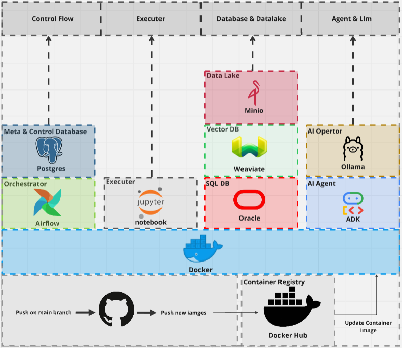
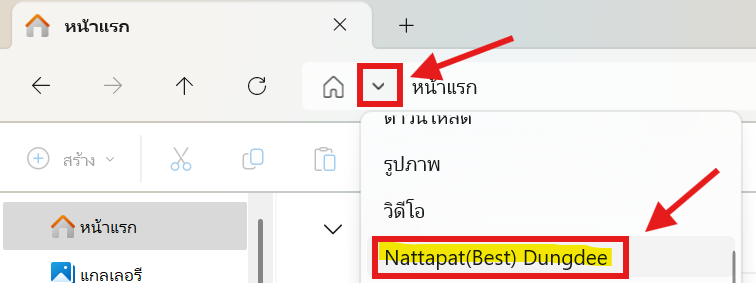
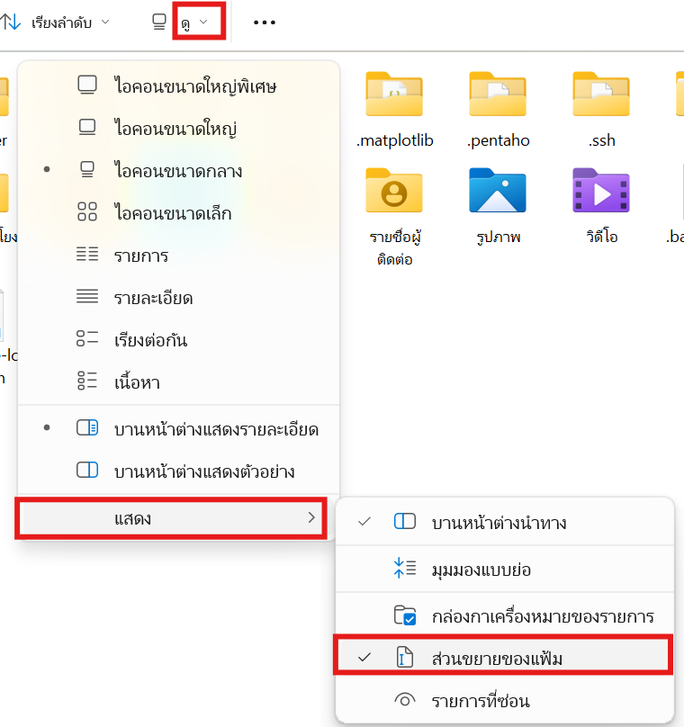
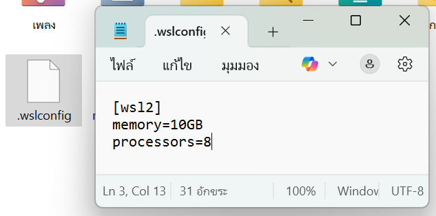
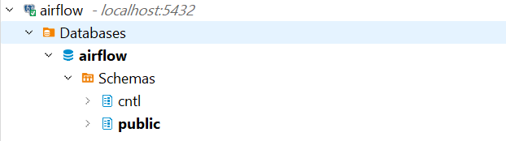
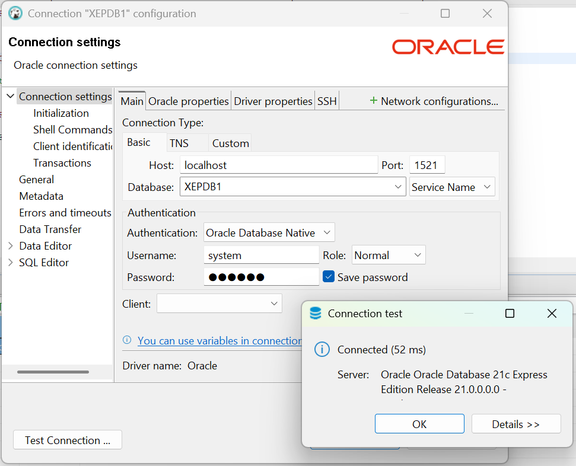
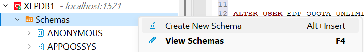
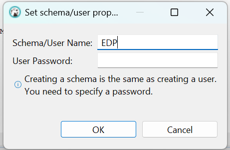
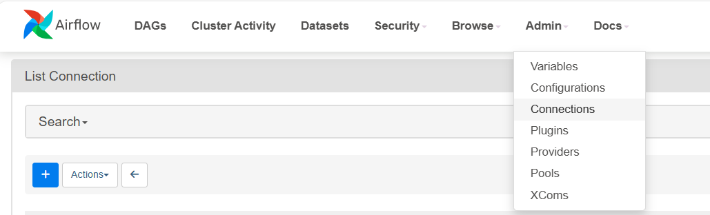
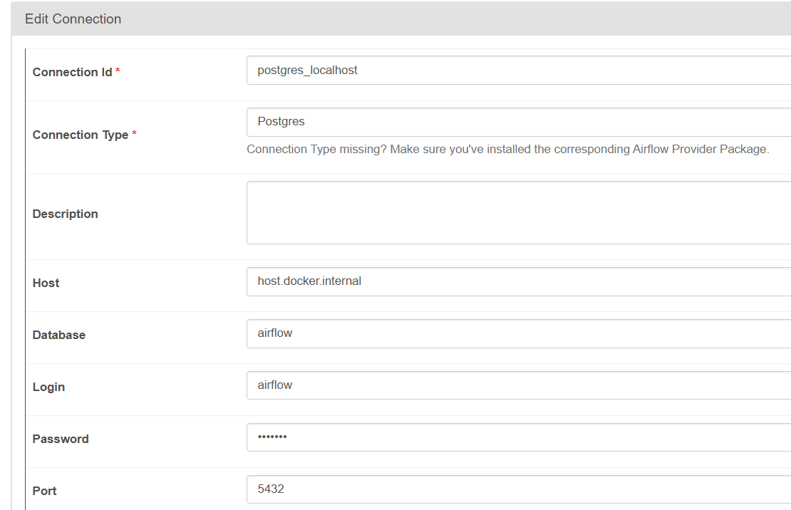

# LLM Local Framework

## Table of Contents
- [Introduction](#introduction)
- [Tech Stacks](#tech-stacks)
- [Tech Stack in Detail](#tech-stack-in-detail)
- [Prerequisites](#prerequisites)
- [Environment Setup](#environment-setup)
- [Stop the Framework](#stop-the-framework)
- [Reference](#reference)

---

## Introduction

### Framework Purpose

> This framework extends traditional ETL capabilities by integrating AI and LLMs into the processing loop. It allows you to develop AI agents locally and deploy them into a Jupyter Notebook container to leverage LLM features in processing tasks.

---

## Tech Stacks



The diagram above shows four main service groups that work together to enable this framework.

---

## Tech Stack in Detail

- ### [Control Flow](dags/README.md)
- ### [Executor](NOTEBOOKS/README.md)
- ### [Database & Data Lake](DATABASE&DATALAKE\README.md)
- ### [Agent & LLM](ADK/README.md)

---

## Prerequisites

- At least **16 GB RAM** is required on any OS (Windows, macOS, etc.) because local LLM processing can consume **5–7 GB RAM per call** using your machine's CPU/GPU.

---

## Environment Setup

### 1. Install DBeaver (Free GUI for DBs)
- Download: https://dbeaver.io/download/

---

### 2. Extends RAM and Processing core for AI Development(Ollama-Local usecase)
-  **Open File Explorer → ▽ → Your computer account**

   

-  Enable file name extention by **View → Show → Filename Extensions**

   

-  Create a file name **.wslconfig** and paste these following value in this config file or adjust as you need
```
[wsl2]
memory=10GB
processors=8
```
   

---

### 3. Build the Jupyter Notebook Docker Image

```bash
docker build -t jupyter/base-notebook:latest .
```

- This image acts as the processing unit.
- To add more Python modules:
  - Edit `requirements.txt`
  - Rebuild the image.

---

## 4. Start the Framework

To start run this docker compose command and wait for docker to download other image for framework, it can take time **~1-2 hrs** to download all image:
```bash
docker compose up -d
```

<table border="1">
  <tr>
    <th><strong>Service Name</strong></th>
    <th><strong>Port (with Link to Localhost)</strong></th>
  </tr>
  <tr>
    <td>airflow-webserver</td>
    <td><a href="http://localhost:8080">8080</a></td>
  </tr>
  <tr>
    <td>jupyter</td>
    <td><a href="http://localhost:8888">8888</a></td>
  </tr>
  <tr>
    <td>minio</td>
    <td><a href="http://localhost:9000">9000</a></td>
  </tr>
</table>


--- 

### 5. Set Up Control Database

- Connect to Oracle using the follwing configuration: 

```
Host: localhost
Port: 5432
Database: airflow
Username: airflow
Password: airflow
```

- Create schemas `cntl` as shown:

  

- Run these following query in postgress database to create table and insert sample stream & process:
  - `DATABASE&DATALAKE/DDL/DDL_Control_table.sql`
  - `DATABASE&DATALAKE/DDL/insert_data.sql`

---

### 6. Set Up SQL Database 

#### 6.1 (Windows)

- Connect to Oracle using the follwing configuration: 

```
Host: localhost
Port: 1521
Database: XEPDB1
Username: system
Password: oracle
Role: Normal
```

  

- Nav to Schemas and select `Create New schema` then create Schema name `EDP`

  

  

- Create schema `EDP`:
  ```sql
  ALTER USER EDP QUOTA UNLIMITED ON USERS;
  ```

> You can repeat the steps to create other schemas.

---

#### 6.2 (Mac-os)

- Follow this guide: https://www.youtube.com/watch?v=uxvoMhkKUPE
- You may need to increase Docker memory/disk space.

**Optional: Disable restricted mode**
```bash
docker exec -it oracle19 bash
sqlplus sys/mypassword1@localhost:1521/ORCLCDB AS SYSDBA
ALTER SYSTEM DISABLE RESTRICTED SESSION;
```
Exit SQL and bash with `Ctrl + D`.

Grant tablespace:
```sql
GRANT UNLIMITED TABLESPACE TO sys;
```

> Wait 5–8 minutes for Oracle to initialize and become fully available.

---

### 7. Connect Apache Airflow to PostgreSQL

  
  
  

- Go to **Admin → Connections**, and configure as shown.

---


## Stop the Framework


To stop run this docker compose command to shut down all services:
```bash
docker compose down
```

---

## Reference

Ref for design inspiration:  
- [Reddit - My 3rd Data Project with Airflow, Docker, Postgres](https://www.reddit.com/r/dataengineering/comments/124wcjb/my_3rd_data_project_with_airflow_docker_postgres/)


