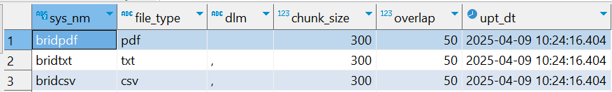
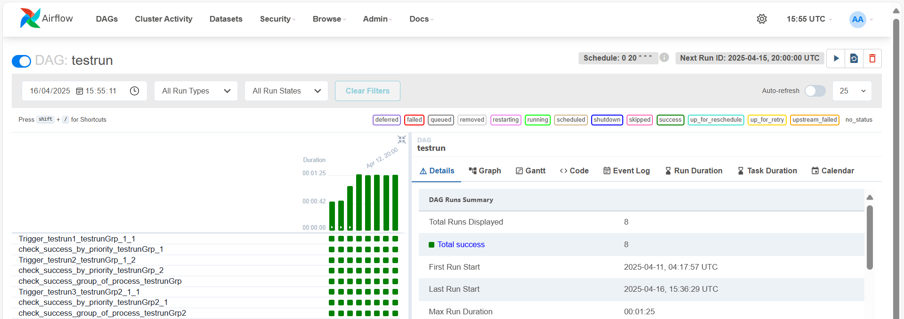

# LLm Local Framework

# Table of content
- [Introduciton](#Introduciton)
- [Services Use](#Services-Use)
- [Components of Framework](#Components-of-Framework)
- [Process Flow](#process-flow)
- [Pre-require](#pre-require)
- [Set up environment](#Set-up-environment)
- [Reference](#Reference)


# Introduciton
#### Project purpose
 > This framework was build for perform task on specific business task group like merchandise recommendation, etc. with specific framework structure pattern which will show later. the framework bring Llm into loop for extract reasoning of llm based on provided data or as we already know in the name 'RAG' also try other technique which be useful as well.
 

# Services Use
 

&nbsp; From picture above there are 5 main services involve in this porject hosted on docker each serivces serve as different purpose but work along together.om 

# Components of Framework 

### Control table


&nbsp; Control tables have 7 control table which server different purpose
- 1.CNTL_AF.CNTL_CFG_STREM
   
   - used for register strem name of workflow, by each workflow can have many process group.
- 2.CNTL_AF.CNTL_CFG_PRCS_GRP
   
   - used for register process group in a stream workflow, by each process group can have many process.
- 3.CNTL_AF.CNTL_CFG_PRCS
   
   - used for register process, ideally each process should store at most 1 process per process group
- 4.CNTL_AF.CNTL_CFG_SYS_FILE
   
   - used for register process file type, by each process can have only one system file per process.
- 5.CNTL_AF.CNTL_CFG_PRCS_DEPN
   
   - used for register process dependency, by each process can have many depend process but cannot depend itself.
- 6.CNTL_AF.CNTL_CFG_SCHEDULE
   
   - used for register workflow schedule time.
- 7.CNTL_AF.CNTL_CFG_LOG
   
   - used for logging process status like sucess or error inclusive with message.

### orchestrator

 > orchestrator which reponsible by apache airflow is acting like controller who manage meta data config for each process and perform logging for call back and observability purpose by Dag in this framework will consits 2 Dag type one is stream type and another is process type, each one serve with different purpose. the stream type are focus to control running of process divide by it process group and priority. the process type reserve as exeute notebook and trigger process that it have depend with. these 2 type dag work along together to perform task in each stream with process in detail. 

   
   - From picture above show stream type dag that manage process in each process group and priority also in low level like process too.

   
   - From picture above show process type dag that have two process need to trigger before execute notebook itself.

### Data Lake
   
   - From picture above show data storage used by minio as blob storage or another name call 'data lake' which can store file in various format for purpose like store output result and associate file with any process.


### Executer
   
   - From picture above show jupyter folder that contain many of jupyter-notebook.


   
   - From the picture above show jupyter-notebook that can be triggered by apache airflow and also can receive config data tht have passing through apache airflow as well


### Vector Database
   
   - From picture above show design of data store in vector database which reponsible by weaviate. due to there no user interface for vector database unlike traditional database like oracle or hive or mysql so according to the picture we can see that data in vector database are store in 'collection' format which each collection can have many data which each one can have 'flexible properties' that can be design in various format for retrieval purpose.

### AI Operator
   - due to there no user interface for display like vectore database so there no picture here but it purpose of Ai operator is for communicate with jupyter-notebook, whenever llm are called by jupyter-notebook the requests will be send to the Ai operator which responsible by Ollama as Llm storage and run.


# Process Flow 


&nbsp; From picture above there are Process Flow of framework which will recieve parameter from postgres that act like config&metadata database then passing into apache airflow as a orchestrator then airflow itself will sending critical parameter as config to jupyter-notebook by jupyter-notebook will directly communicate with Ai operator like Ollama, Vector database like Weaviate and Datalake like Minio to perform task that have Llm in the loop of processing.

# Pre-require

- At least 16 GB ram are require for any operation system no matter window, mac, etc. because when we call llm as in local it will use our GPU/CPu in our computer as processing for Llm whcih will take around 5-7 GB ram per call.

# Set up environment
-  Download postgres database
   -  you need to install postgres database for using it as config and meta data control database https://www.postgresql.org/download/ 

-  Dockerfile setup for spark-iceberg image
   -  ```docker build -t jupyter/base-notebook:latest . ```
   -  this container will act like processing and clustering unit, you can append more python module via add it into **requirements.txt** after added you need to re-build the image again.

# Start Framework
- run ```docker compose up -d``` for detach mode and wait for image to complete it installation
- after finish work run ```docker compose down```


# Reference
Ref for stylish design : 
   - https://www.reddit.com/r/dataengineering/comments/124wcjb/my_3rd_data_project_with_airflow_docker_postgres/

 


 