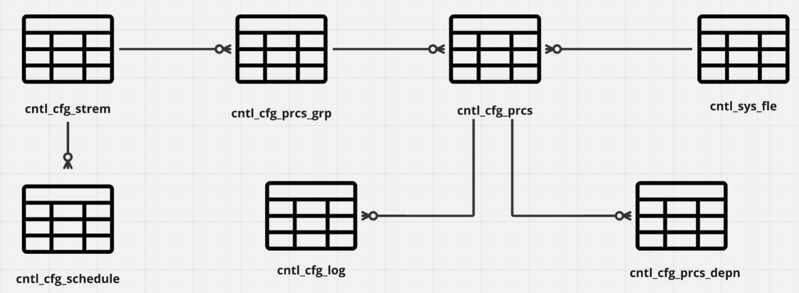

# Low Code Data Distributed Processing Framework On Top Apache-Airflow

# Table of content
- [Introduciton](#Introduciton)
- [Services Use](#Services-Use)
- [Components of Framework ](#Components-of-Framework )
- [Set up environment](#Set-up-environment)
- [Reference](#Reference)
- [Unsolve Problem](#Unsolve-Problem)


# Introduciton
#### Definiton
 > A data processing framework is a tool that manages the transformation of data in multiple steps. These steps are typically represented as a directed acyclic graph (DAG), also known as a pipeline, workflow, or dataflow.

#### What it does?
&nbsp; Typically main role of data processing framework is to orchest workflows like when to start running the task?, what is the next task to run?, when it need to stop? these step are managed by data processing framework or we can call it in short by 'Orchestrator' or 'Framework', it really depend on people you work with will call but it doesn't matter.

#### What is it benefit?
&nbsp; Main benefit of data processing framework is centalize group of workflow together and can manage all of its in one place also scability, observabiliy etc.

#### Why on top apache-airflow?
&nbsp; Even I said that Low-code but it not really no code, every task still need to process by code somehow. Typically the apache-airflow is the code base orchrestrator which you need to re-write|copy your code every time that you want to create new task, In this project I will apply concept of control table to our data processing framework. the main benefit that we will get from apply this concept is scalability make you can replicate task which do the same step but different parameter easier and faster.

# Services Use
 

&nbsp; From picture above there are 5 main services involve in this porject hosted on docker each serivces serve as different purpose but work along together. not only control table concept we will put the concept of data lakehouse, data warehouse into our project as well.


# Components of Framework 

### Control table



&nbsp; Control tables have 6 control table which server different purpose
- 1.CNTL_AF.CNTL_CFG_STREM
   
   - used for register strem name of workflow, by each workflow can have many process group.
- 2.CNTL_AF.CNTL_CFG_PRCS_GRP
   
   - used for register process group in a stream workflow, by each process group can have many process.
- 3.CNTL_AF.CNTL_CFG_PRCS
   
   
   - used for register process, by each process can be store in many process group
- 4.CNTL_AF.CNTL_CFG_PRCS_DEPN
   
   - used for register process dependency, by each process can have many depend process but cannot depend itself.
- 5.CNTL_AF.CNTL_CFG_SCHEDULE
   
   - used for register workflow schedule time.
- 6.CNTL_AF.CNTL_CFG_LOG
   
   - used for logging process status like sucess or error inclusive with message.

### Orchestrator 


&nbsp; Orchestrator(apache-airflow) is directly associate with the control table by pulling config data from control table then dynamically generate task that associate with config in control table order by process group/process task priority as shown in picture below

##### Stream Dag 


&nbsp; In stream dag we will divide process based on it process group and process priority 

##### Process Dag


&nbsp; In process will have two major task which is trigger it dependency and execute notebook from notebook path configuration

### Processing & Clustering and Data lakehouse & Data warehouse 
#### Datalakehouse and warehouse architecture


&nbsp; From picture above we can see that this picture consists of 3 services: 
   -  Processing&Clustering: reponsible by <span style="color:red;">spark-iceberg</span> services by combining spark that act like processing unit and iceberg 
      which is Open-Table-Fomat(OTFs) as a solution that leverages distributed computing and distributed object stores to 
      provide capabilities that exceed what is possible with a Data Warehouse .
   -  Data lakehouse: reponsible by <span style="color:red;">minio</span> act like blob files storage like amazon s3, you can store any data in any format in minio.
   -  Data warehouse: reponsible by <span style="color:red;">oracle(PDB-->portable database)</span> act like data warehouse to store data in structural format.


# Data tier concept
&nbsp; Data tier concept is most commonly use in data processing framework project, this concept can enhance data management easier by improve
observabiliy, loging, tracking and data organization 

#### Data tier1


&nbsp; tier1 of data management is for make procedure to control all process that coming to this loop, generally tier1 is defied as transform any 
data format from various source into staging layer which format is structure format


#### Data tier2


&nbsp; tier2 of data management is to transform staging layer into up tier like Dimention or Fact table, typically is to direct load data and table format from
staging layer into Dimention or Fact table directly but we can do some transformation if need.

#### Data tier3


&nbsp; tier3 of data management is to do some aggregation from Dimention and Fact table, you do some thing like sum, group by,
join and much more.

# Set up environment
-  Set up Oracle Database (PDB) for macos
   -  follow the link to install oracle on macos, you may need to extend memory or disk usage in docker: https://www.youtube.com/watch?v=uxvoMhkKUPE
   -  problem with restricted mode run as follow (optional)
      - docker exec -it oracle19 bash
      - sqlplus sys/mypassword1@localhost:1521/ORCLCDB AS SYSDBA
      - ALTER SYSTEM DISABLE RESTRICTED SESSION;
      - ctrl + D to exit sql mode, same with bash mode
   - grant privilege
      `GRANT UNLIMITED TABLESPACE TO sys`
      
   ***Note: you need to wait for few minute(up to 5 minutes for CDB mode and 8 minutes for PDB mode) to let the oracle finished it initialization and leave restrict mode, then you will fully connect to the database***

-  Download postgres database
   -  you need to install database for using postgres(same as oracle) https://www.postgresql.org/download/ 
   -  after installed the image in docker compose file will do it job.

-  Dockerfile setup for spark-iceberg image
   -  ```docker build -t jupyter/base-notebook:latest . ```
   -  this container will act like processing and clustering unit, you can append more python module via add it into **requirements.txt** after added you need to re-build the image again.


# How to start it? 
-  after the setup spark-iceberg image and oracle image already, you can simply run ```docker compose up -d ``` to start all container, the left image will automatically download to your computer.
-  build new process by using this command to create new template with variable --env script/PRCS_TEST_FRAMEWORK4.py --build ```./dags/framework/app.sh --env script/PRCS_TEST_FRAMEWORK4.py --build```


# Reference
Ref for stylish design : 
   - https://www.reddit.com/r/dataengineering/comments/124wcjb/my_3rd_data_project_with_airflow_docker_postgres/

Ref for iceberg OTFs annd minio docker-compose file:
   - https://blog.min.io/a-developers-introduction-to-apache-iceberg-using-minio/


# Unsolve Problem
-  Spark-iceberg catalog recognition: the catalog cannot recognize data in warehouse bucket make it need to register database and table every time after re-compose docker

- Externaltasksensor cannot be use with TriggerDagRunOperator in apache airflow, make the Dags like PRCS_TEST_FRAMEWORK1, PRCS_TEST_FRAMEWORK2, PRCS_TEST_FRAMEWORK3 will not wait for previous Dags to complete before execute itself.